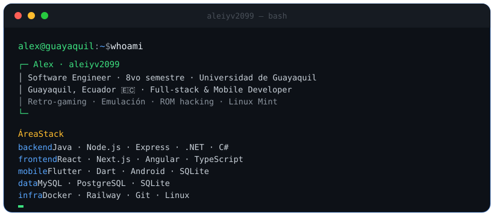

<!-- header de terminal (subí también el archivo header.svg a la raíz del repo) -->

  

<h1 align="center">Alex — aleiyv2099</h1>

<b>Construyo sistemas web y móviles completos — de la base de datos a la interfaz.</b>

<i>I build complete web &amp; mobile systems — from database to interface.</i>

<!-- ⬇️ REEMPLAZA los enlaces con los tuyos -->

  
  
  

<!-- badges de "categoría" al estilo del que te gustó -->

  
  
  
  

  

  <a href="#-stack">Stack</a> ·
  <a href="#-proyectos">Proyectos</a> ·
  <a href="#-sobre-mí">Sobre mí</a>

---

## 🧑‍💻 Sobre mí

Estudiante de **Ingeniería de Software (8vo semestre)** en la **Universidad de Guayaquil**. Trabajo full-stack y desarrollo móvil: diseño de base de datos, APIs, y clientes web/móvil. Me muevo cómodo entre **Windows, Linux y Android**, y me gusta la preservación de videojuegos retro (emulación, ROM hacking, hex editing).

> *Software Engineering student (8th semester) at Universidad de Guayaquil. Full-stack &amp; mobile developer: database design, APIs, and web/mobile clients.*

---

## 🛠 Stack

**Backend**

**Frontend**

**Mobile**

**Data &amp; Infra**

---

## 🚀 Proyectos

### En producción
- **[Simulador de Preguntas — Frontend](https://github.com/Mickaell22/SimuladorPreguntasFrontend)** · `React` · `TypeScript` — Simulador de exámenes, interfaz web.
- **[Simulador de Preguntas — Backend](https://github.com/Mickaell22/SimuladorPreguntasBackend)** · `Node.js` · `Express` · `PostgreSQL` — API y lógica del simulador.

### Web &amp; Full-stack
- **[Cinema Management System](https://github.com/aleiyv2099/Cinema-Management-System)** · `NodeJS` · `Angular` · `TypeScript` — Gestión de cine.
- **[Proyecto Cerbero](https://github.com/aleiyv2099/Proyecto-Cerbero)** · `TypeScript` — Proyecto web.
- **[DAWA](https://github.com/R0naldSm/DAWA)** · Desarrollo de Aplicaciones Web Avanzado (colaboración).
- **[Students-Online](https://github.com/aleiyv2099/Students-Online)** · `Java` — Sistema de gestión de estudiantes.

### Móvil
- **[FishGold Flutter](https://github.com/aleiyv2099/fishgoldflutter)** · `Flutter` · `Dart` · `SQLite` — App de gestión de puerto pesquero (Puerto Seguro).
- **[TareaFishGold](https://github.com/aleiyv2099/TareaFishGold)** · `Java` · `Android` · `SQLite` — Versión Android nativa de FishGold.

### Java / Escritorio &amp; académicos
- **[Grupo6 — Sistema de Viajes](https://github.com/aleiyv2099/Grupo6_SistemaViajes-master)** · `Java 17` · `Swing` · `MySQL` · `JUnit` — Agencia de viajes (módulo de Facturación, curso V&amp;V).
- **[Parqueadero Mall Del Fortín](https://github.com/aleiyv2099/Parqueadero-Mall-Del-Fortin-3er-Semestre)** · `Java` · `Swing` · `MySQL` — Sistema de estacionamiento.
- **[Estacionamiento — 2do Semestre](https://github.com/aleiyv2099/Grupo-1-Estacionamiento-2do-Semestre)** · `Java` — Ejercicio OOP de estacionamiento.

### Retro / Modding
- **[PES Fan Editor — Python Port](https://github.com/aleiyv2099/Pes-Fan-Editor-Python-Port)** · `Python` — Port a Python del PES FAN Editor (originalmente en Java).

---

  
  

